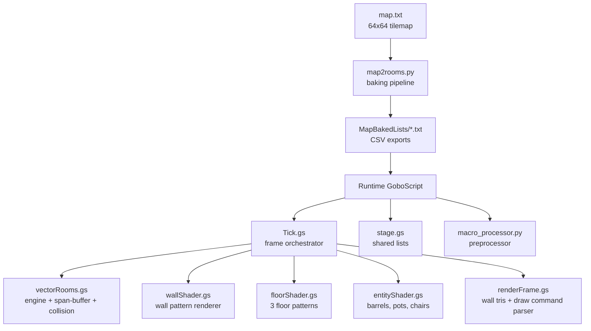

# vectorSector

A **2.5D sector-based vector rendering engine** built in Scratch / GoboScript. It transforms a tilemap into vector rooms, renders them with a span-buffer occlusion pipeline, and draws floors, walls, and entities using geometric primitives and textured wall patterns.

Inspired by the flat-shaded vector graphics of **The Colony** (1988, Mac) and **Hunter** (1991, Amiga), the engine uses geometric patterns instead of per-pixel texturing to keep the renderer fast. A tokenized `drawCommands` queue lets wall and entity phases do the expensive math during a build phase, while `renderFrame` only interprets those tokens to draw final geometry.

## Architecture



## Map Format

`map.txt` is a 64×64 grid (4096 tokens):

- `0` — walkable floor
- `1` — wall
- `2` — door (recessed pocket door)
- `a`, `b`, `c` — entity spawns (type 1, 2, 3)

## Baking Pipeline (`map2rooms.py`)

Runs offline before playing. Reads `map.txt` and writes `MapBakedLists/*.txt`.

1. **Flood fill void** — Marks unreachable exterior void tiles as `-1`.
2. **Cull unreachable pockets** — Keeps only the largest connected walkable region.
3. **Room detection** — Flood-fills remaining `0` tiles into distinct room IDs, building `map_room_id`.
4. **Entity assignment** — Places authored entities into their room's local entity block.
5. **Wall tracing (4 passes)** — Scans north, south, west, east edges of wall tiles to create vector edges with types (`1` = wall, `2` = door).
6. **Door splitting** — For each `2` tile, generates recessed pocket-door geometry: two sliding door edges plus four frame edges.
7. **Vertex deduplication** — Shared vertices between rooms are merged into a single `vertex` list.
8. **Bounding box computation** — Calculates `minX, minY, maxX, maxY` per room for floor culling.
9. **Texture ID assignment** — Rooms with ≥64 tiles → `3` (grid); ≤1 door → `1` (checkerboard); else → `2` (plank).
10. **Packing** — Writes 6 CSV files: `map_export.txt`, `vertex.txt`, `edges.txt`, `edgeId2Roomid.txt`, `map_room_id.txt`, `rooms.txt`, `room_ptr.txt`.

## Runtime Pipeline

1. **Tick.gs (frame orchestrator)** — Runs a `forever` loop that broadcasts to each subsystem in sequence each frame: `_2.5DEngine`, `wallShader`, `entityShader`, `renderFloor`, `renderWalls`. Then reads cross-sprite timing variables to update the on-screen FPS/stats display.
2. **vectorRooms / _3dEngine** — Core frame builder:
   - Resolves current room and connected room via `map_room_id`
   - **Pass 1** — Vertex shader: transforms world vertices to camera space
   - **Pass 2** — Edge assembly: back-face culls, near-plane clips, and projects to screen X
   - **Pass 3** — Entity harvesting: billboard extraction with bung-bearing resolution
   - **Span-buffer sort** — Front-to-back painter's algorithm with a 481-column occlusion buffer
3. **wallShader** — Emits draw commands for walls into the shared `drawCommands` list. Supports four patterns:
   - `greekKeyWallPattern` — Greek key motif with dashed horizontal rows
   - `offset5x5BrickWallPattern` — Running bond brick with offset rows
   - `quoinVLineWallPattern` — Quoin stamps with V-line divisions
   - `octagonWallPattern` — Octagonal tile with Sutherland-Hodgman polygon clipping
4. **entityShader** — Emits draw commands for entities into the shared `drawCommands` list
5. **floorShader** — Renders the floor directly using one of three patterns based on `roomTextureId`
6. **renderFrame** — Consumes `drawCommands` and renders wall trapezoids, entity primitives, and structural outlines

## Draw Command Primitives

`renderFrame.gs` interprets a tokenized `drawCommands` list. Each token is followed by its parameters:

| Token | Parameters | Description |
|-------|-----------|-------------|
| `stamp` | `x, y, size, dir, costume_name` | Stamps a vector costume at screen position |
| `ellipse` | `x, y, w, h, dir, brightnessDelta, color` | Filled/stroked ellipse (used for barrel lids, bungs, leaves) |
| `penline` | `x1, y1, x2, y2, pen_size` | Straight line with variable thickness |
| `trapezoid` | `x1, x2, y1, y2, y3, y4, color, border` | Filled vertical-aligned trapezoid with optional black outline |
| `quad` | `x1, y1, x2, y2, x3, y3, x4, y4, color, border` | Filled arbitrary quadrilateral with optional outline |
| `gotoWalker` | `x, y, x, y, ..., EoL` | Series of connected line segments |
| `dash_line` | `x, y, dir, parity, d1, d2, ..., EoL` | Dashed line along a direction; parity controls dash/gap alternation |
| `EoL` | none | End of Line — terminates `gotoWalker` or `dash_line` |
| `EoW` | none | End of Wall — terminates a wall's draw command block |
| `EoEnt` | none | End of Entity — terminates an entity's draw command block |

## Shared Data Lists

**Global lists** (declared in `stage.gs`, accessible by all sprites):

- `walls` — 13-element stride: `[sx1, z1, sx2, z2, face, type, edge, cmdIdx, ceilY, floorY, frameEdge_idx, textureId, roomId]`
- `drawCommands` — Token queue consumed by `renderFrame`
- `roomBB` — 4-element bounding box: `[minX, minY, maxX, maxY]`
- `frustrumFloorTiles` — Visible floor tile indices for the current frame
- `frameEdge` — 15-element stride per edge: `[edge_id, edge_type, num_tiles, textureId, isDoorFrame, wx1, wy1, wx2, wy2, tx1, tz1, tx2, tz2, ceil_z, floor_z]`
- `frameEntity` — 11-element stride per entity: `[type, zAvg, x1, z1, x2, z2, roomId, drawIdx, dir, viewDir, tileIdx]`

**Baked map lists** (loaded from `MapBakedLists/*.txt` into `vectorRooms.gs`):

- `map` — 4096-element tile grid
- `map_room_id` — 4096-element room ID grid
- `rooms` — Packed room database. Each room: 4-item header `[V, E, F, Ent]` + vertex IDs + edge IDs + floor tile IDs + 4-item bounding box + entity stride `[tile_idx, type]`
- `room_ptr` — Starting index in `rooms` for each room
- `edges` — 6-element stride per edge: `[type, v1, v2, num_tiles, c_face, normal_angle]`
- `vertex` — 2-element stride per vertex: `[x, y]`
- `edge2Room` — Primary room ID per edge

## Design Constraints

- **No per-pixel rendering** — All wall and floor textures are generated from geometric primitives (stamps, ellipses, pen lines, recursive triangle fills). The renderer stays fast by never touching individual pixels.
- **Build-phase / render-phase split** — Wall and entity shaders do their expensive math before `renderFrame` runs, emitting simple tokens. `renderFrame` only interprets those tokens, making the render path predictable. The floor renders directly in its own phase and does not use `drawCommands`.
- **Single-door constraint** — Only one door can be open at a time, which limits the engine to at most **2 visible sectors per frame**. This keeps the span-buffer and sort work bounded.

## Key Features

- **Sector-based rendering** — Walls are shared between rooms via vertex deduplication
- **Span-buffer occlusion** — 481-column clip buffer handles wall-to-wall visibility
- **Recessed pocket doors** — Split-frame doors with animated open ratio
- **Textured wall patterns** — Greek key, brick, quoin, and octagon wall shaders
- **Three floor patterns** — Checkerboard (recursive triangle fill), plank grid, and basic grid
- **Vector entities** — Barrel (ellipses + orbiting bung), plant pot (leaves with world-angle rotation), chair (full 3D polygon model)
- **Draw command batching** — Walls and entities emit tokens consumed by a single render loop; floor renders directly

## Project Structure

```
vectorSector/
├── assets/                      # Textures and vector costumes
├── MapBakedLists/               # Pre-baked map data CSVs
├── debug/                       # Frame debug dumps
├── map.txt                      # Source tilemap
├── map2rooms.py                 # Room/edge/vertex baking
├── mapEditor.py                 # Map authoring tool
├── macro_processor.py           # GoboScript preprocessor
├── stage.gs                     # Shared lists (globally scoped)
├── vectorRooms.gs               # Core engine, collision, span buffer
├── wallShader.gs                # Wall texture pattern renderer
├── floorShader.gs               # Floor pattern renderer
├── entityShader.gs              # Entity draw command builder
├── renderFrame.gs               # Wall renderer + draw command parser
├── Tick.gs                      # Frame orchestrator and FPS stats
└── README.md
```
